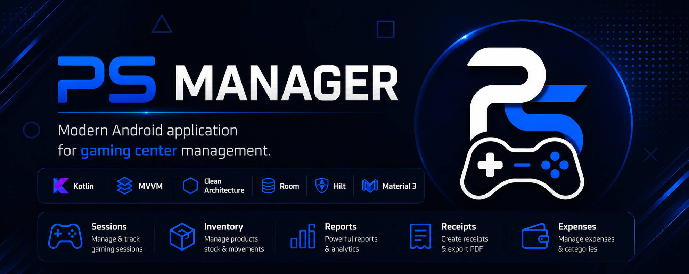
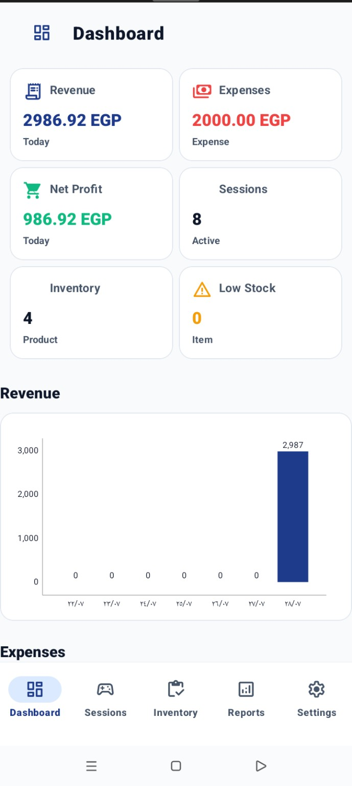
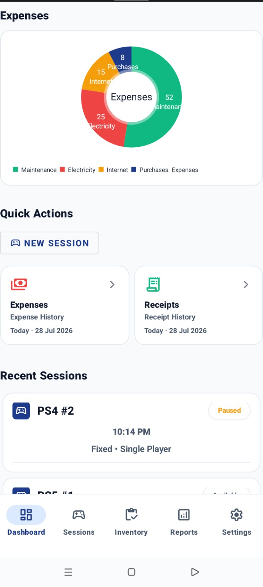
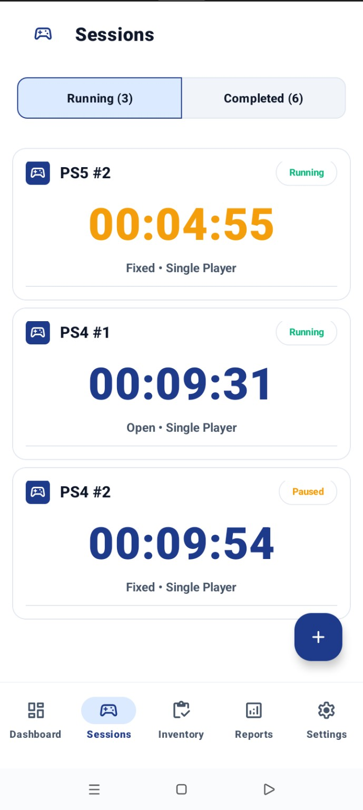
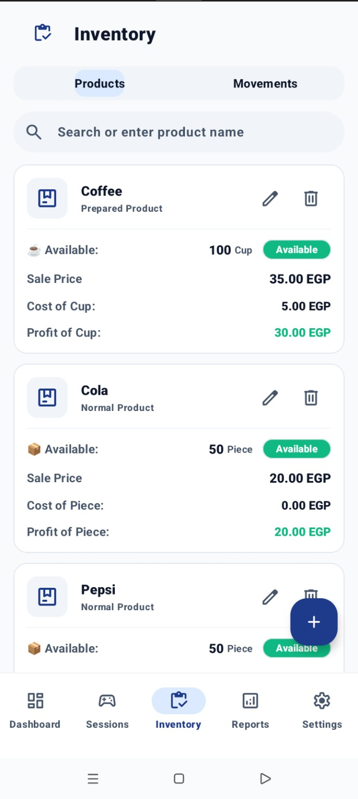
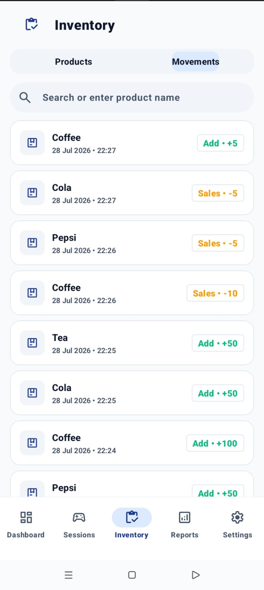
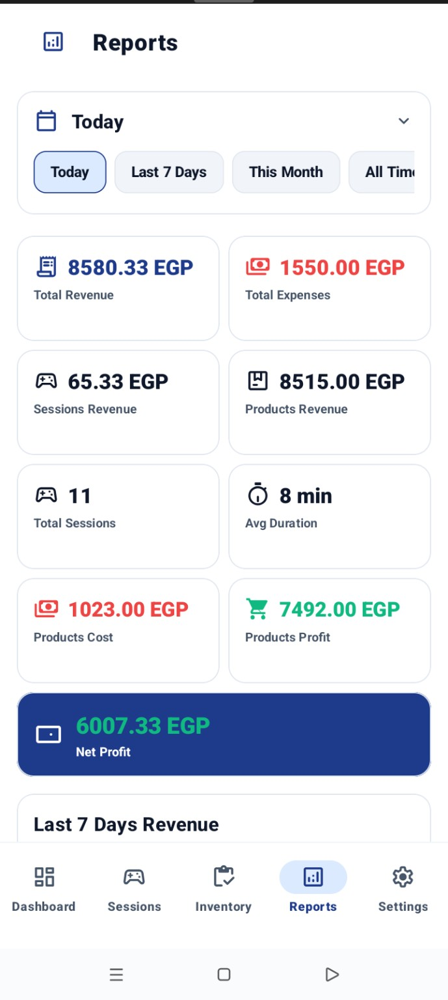
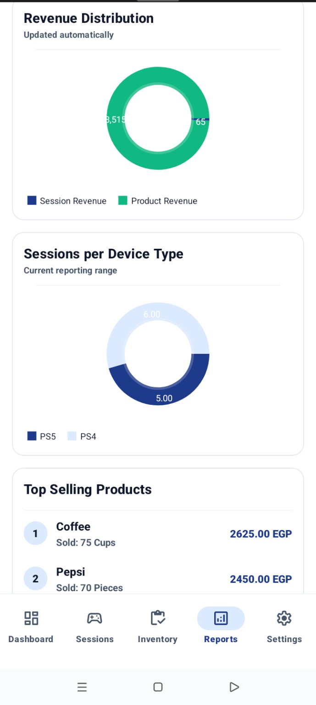
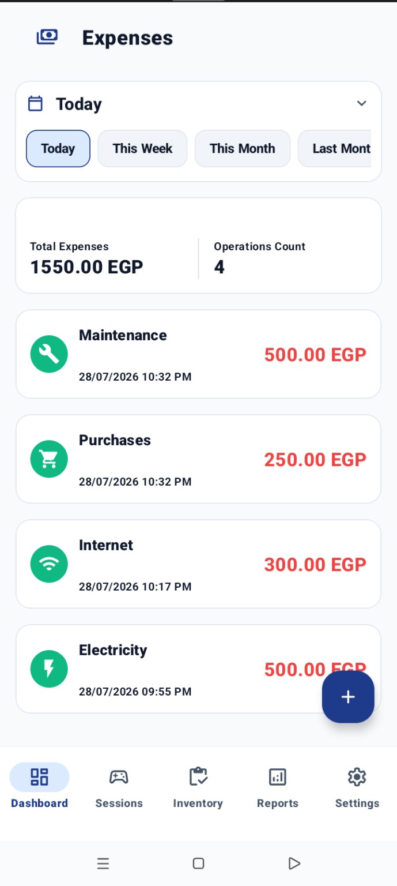
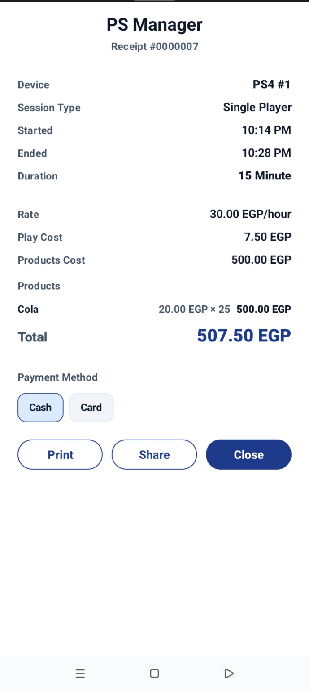

<div align="center">



# PS Manager

**Modern Android application for managing PlayStation gaming centers.**


</div>

---

# 📖 Overview

PS Manager is a modern Android application built to simplify the daily management of PlayStation gaming centers.

The application provides session management, inventory tracking, expense management, reports, receipt generation, backup & restore, and business analytics in a clean and modern user experience.

The project follows modern Android development practices using MVVM, Clean Architecture, Kotlin Coroutines, Flow, Hilt, Room, and Material 3.

---

# ✨ Features

- 🎮 Gaming session management
- 📦 Inventory & stock movement tracking
- 💰 Expense management
- 🧾 Receipt generation
- 📊 Reports & analytics
- 📈 Dashboard statistics
- 🌙 Dark mode
- 🌍 Multi-language support
- 💱 Multi-currency support
- 💾 Backup & Restore
- ⚡ Offline-first architecture

---


## 📱 Screenshots

<p align="center">
  
  
</p>

<p align="center">
  
  
</p>

<p align="center">
  
  
</p>

<p align="center">
  
  
</p>

<p align="center">
  
</p>


---

# 🏗 Architecture

The project follows **Clean Architecture** with the **MVVM** design pattern.

```
Presentation
     │
     ▼
Domain
     │
     ▼
Data
```

---

# 🛠 Tech Stack

- Kotlin
- MVVM
- Clean Architecture
- Coroutines
- Flow
- Hilt
- Room
- DataStore
- Navigation Component
- Material 3
- ViewBinding

---

# 📂 Project Structure

```
app/
├── data/
├── domain/
├── presentation/
├── di/
├── utils/
└── core/
```

---

# 🚀 Getting Started

1. Clone the repository.

```bash
git clone https://github.com/MohamedMosad0/Playstation-Manager.git
```

2. Open the project in Android Studio.

3. Sync Gradle.

4. Run the application.

---

# 📋 Requirements

- Android Studio
- JDK 17+
- Android SDK
- Gradle

---

# 📄 License

This project is licensed under the MIT License.
