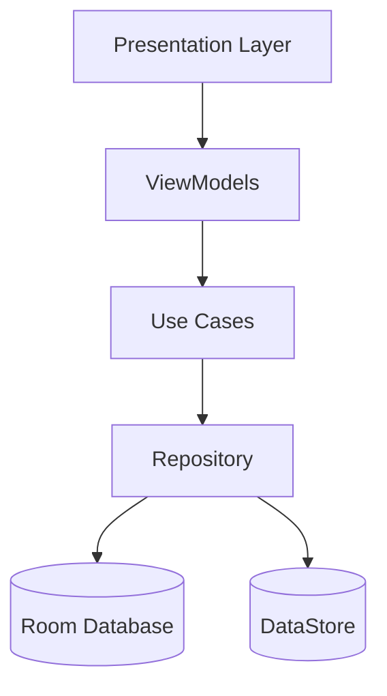

<div align="center">


# PS Manager

### Modern Android Management System for PlayStation Gaming Centers

PS Manager is a production-grade Android application designed to simplify the daily management of PlayStation gaming centers. It provides complete session management, inventory tracking, financial reporting, receipt generation, analytics, backup & restore, and business insights using modern Android development practices.

[](https://developer.android.com)
[](https://kotlinlang.org)
[]()
[]()
[](LICENSE)

</div>

---

# 📱 Screenshots

<p align="center">


</p>

<p align="center">


</p>

<p align="center">


</p>

<p align="center">


</p>

<p align="center">

</p>

---

# ✨ Features

- 🎮 PlayStation session management
- ⏱ Live session timer
- ⏸ Pause & Resume sessions
- 💰 Automatic session pricing
- 📦 Inventory & stock management
- 📈 Product movement history
- 💸 Expense management
- 🧾 Receipt generation
- 📊 Business reports & analytics
- 📉 Charts & KPIs Dashboard
- 🌍 Arabic & English localization
- 💱 Multi-currency support
- 🌙 Dark mode
- 💾 Backup & Restore
- ⚡ Offline-first architecture powered by Room
- 🔔 Session notifications & alarms

---

# 🏛 Architecture

PS Manager follows Google's recommended **Clean Architecture** with the **MVVM** design pattern, keeping business logic independent from Android framework components.



### Layers

- **Presentation** — Activities, Fragments, ViewModels and UI State.
- **Domain** — Business models, repository contracts and use cases.
- **Data** — Repository implementations, Room database, DataStore and local persistence.

---

# 🛠 Tech Stack

| Category | Library / Tool | Purpose |
|------------|----------------|----------|
| Language | Kotlin | Main programming language |
| Architecture | Clean Architecture + MVVM | Separation of concerns |
| Dependency Injection | Hilt | Dependency management |
| Database | Room | Offline-first local storage |
| Preferences | DataStore | User settings |
| Async | Kotlin Coroutines & Flow | Reactive programming |
| UI | Material Design 3 + ViewBinding | Modern Android UI |
| Navigation | Navigation Component | Screen navigation |
| Charts | MPAndroidChart | Reports visualization |
| Background | WorkManager & AlarmManager | Notifications & scheduled tasks |
| Logging | Timber | Debug logging |

---

# 📂 Project Structure

```text
app/
├── core/
│   ├── constants/
│   ├── extensions/
│   ├── helpers/
│   └── utils/
│
├── data/
│   ├── local/
│   ├── repository/
│   └── datastore/
│
├── domain/
│   ├── model/
│   ├── repository/
│   └── usecase/
│
├── di/
│
└── presentation/
    ├── ui/
    ├── state/
    ├── adapter/
    └── viewmodel/
```

---

# ⚙️ Getting Started

## Clone

```bash
git clone https://github.com/MohamedMosad0/Playstation-Manager.git
```

## Requirements

- Android Studio Narwhal (or newer)
- JDK 17+
- Android SDK
- Gradle

## Build

```bash
./gradlew assembleDebug
```

---

# 🧪 Testing

The project includes:

- Unit Tests
- ViewModel Tests
- Repository Tests
- DataStore Tests
- Fake Repository based testing
- GitHub Actions Continuous Integration

Run all tests:

```bash
./gradlew testDebugUnitTest
```

---

# 🚀 Release

Release builds are verified using:

- R8 Code Shrinking
- Resource Shrinking
- ProGuard Rules
- GitHub Actions CI
- Lint
- Unit Tests

---

# 📄 License

This project is licensed under the MIT License.

See the LICENSE file for more information.
